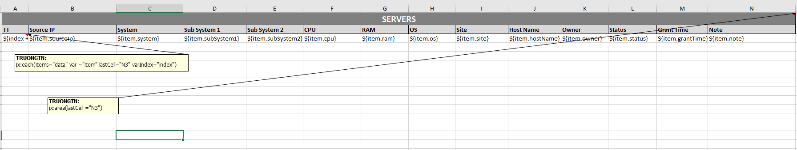
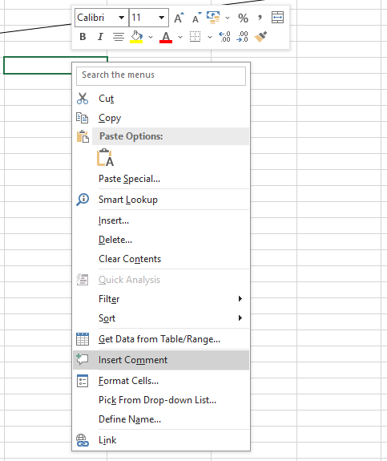

## Technologies 🎰
1. Java 17
2. maven
3. Apache poi 5.2.3
4. Jxls 2.13

## This is the library configuration
```xml
<!-- https://mvnrepository.com/artifact/org.apache.poi/poi -->
<dependency>
  <groupId>org.apache.poi</groupId>
  <artifactId>poi</artifactId>
  <version>5.2.3</version>
</dependency>
<!-- https://mvnrepository.com/artifact/org.apache.poi/poi-ooxml -->
<dependency>
  <groupId>org.apache.poi</groupId>
  <artifactId>poi-ooxml</artifactId>
  <version>5.2.3</version>
</dependency>
<!-- https://mvnrepository.com/artifact/org.jxls/jxls -->
<dependency>
  <groupId>org.jxls</groupId>
  <artifactId>jxls</artifactId>
  <version>2.13.0</version>
</dependency>
<!-- https://mvnrepository.com/artifact/org.jxls/jxls-poi -->
<dependency>
  <groupId>org.jxls</groupId>
  <artifactId>jxls-poi</artifactId>
  <version>2.13.0</version>
</dependency>
```
## Features  ⭐⭐⭐⭐⭐
1. Download template Excel( file in resource)
2. Export data from object to excel template by Jxls
-> Doc: https://jxls.sourceforge.net/reference/if_command.html
3. Read excel data by apache poi

## Details on exporting data to a sample excel file
The data we need is in the form of Map<String, Object>.
For example, when you have a list of Objects, you need to put it into a Map<String, Object>
Ex: 
```java
List<Server> data = initializeData(); // initializeData() return a List<Server>
Map<String, Object> servers = new HashMap<>();
servers.put("data", data);
```
Next, extremely important is the Excel template file

We can see that the excel template file is very similar to the normal file, the only difference is the addition of Comment markup.
It's all here. You can see jx:each(...)
items="data" (Required) 
The key "data" is what you declared in your code. It is a list object
```java
List<Server> data = initializeData();
Map<String, Object> servers = new HashMap<>();
servers.put("data", data);
```
var = "item" (Required)
We will use item as a temporary variable in the foreach loop

lastCell="N3" (Required)
It declares column limits. As in my excel file is at position N3

varIndex="index" 
It represents the index of the item in the list data.
For example, if your Excel file has a column named “No”, we will index that column. And since the index in the list starts at 0, we'll use index + 1

jx:area(lastCell ="N3") (Required)
Please fill in the appropriate box in LastCell

Details about Jxls and comment markup you can see here https://jxls.sourceforge.net/reference/each_command.html

## Note : How to create comment markup 📓


Right-click on the cell and select Insert comment (It's very complicated 🤣)

Here is my code (Only two file)
1. Controller. 
```java
@GetMapping
    public void exportDataToExcelTemplateFile(HttpServletResponse response) {
        try {
            response.setContentType("application/octet-stream");
            response.setHeader("Content-Disposition", "attachment; filename=exportDataToExcelTemplate.xlsx");
            this.exportDataToExcelTemplateService.exportDataToExcelTemplate(response.getOutputStream());
            response.flushBuffer();
        } catch (IOException e) {
            throw new RuntimeException(e);
        }
    }
```
2. Service
```java
@Override
    public void exportDataToExcelTemplate(OutputStream outputStream) {
        List<Server> data = initializeData();

        Map<String, Object> servers = new HashMap<>();
        servers.put("data", data);

        try(InputStream inputStream = this.getClass().getResourceAsStream("/template_exports/template_server_list_for_export.xlsx")) {
            Context context = new Context();
            context.toMap().putAll(servers);
            JxlsHelper.getInstance().processTemplate(inputStream, outputStream, context);
        } catch(NullPointerException e) {
            throw new NotFoundException("Template not found in resources/templates_exports");
        }
        catch (Exception e) {
            throw new RuntimeException(e);
        }
    }
```
## Done
The remaining tasks such as downloading files or reading excel files are very simple and there are many instructions from other programmers so I will not describe them here anymore.
My focus is only on Exporting data to excel template

## Getting Started 🛠

Prerequisites

Java 17

Maven

Installation

```bash
git clone https://github.com/namtruongto/Export-data-to-Excel-template.git
```

Contact 📧
For any questions, please contact tonamtruong17062000@gmail.com
